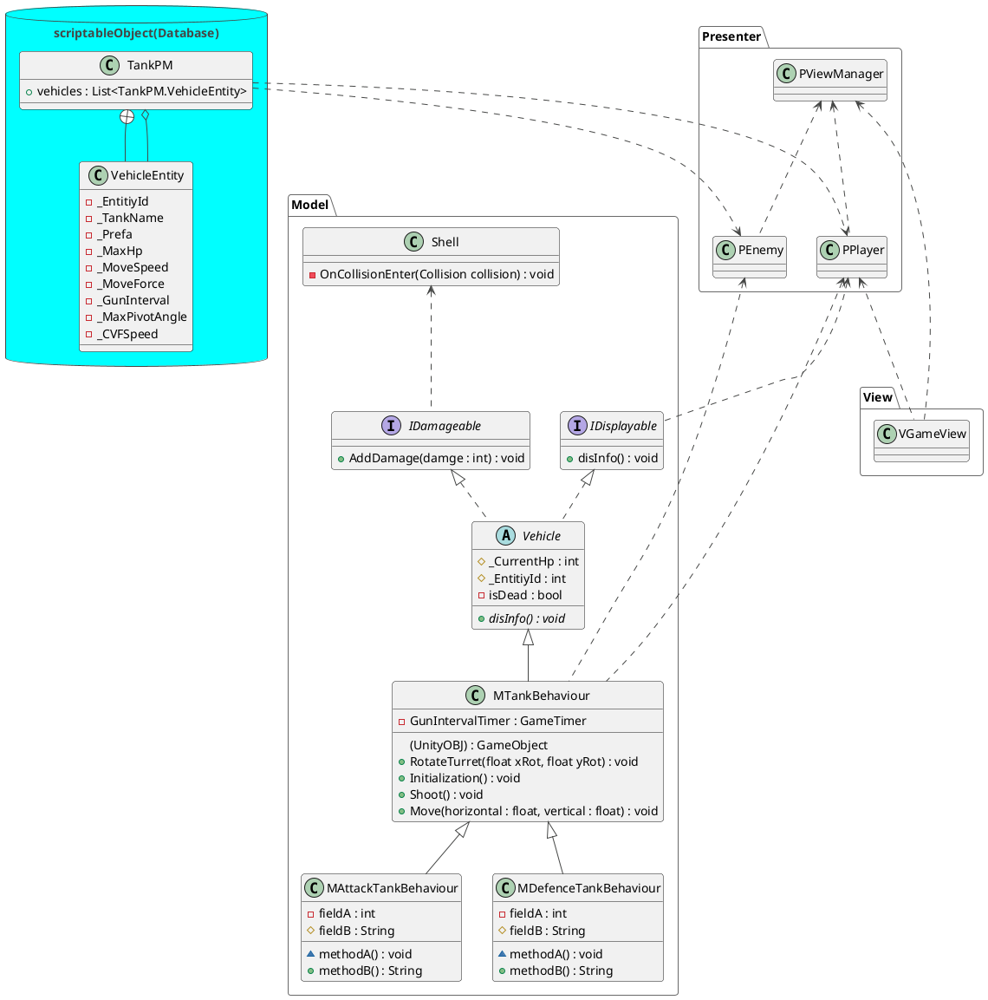

# 技術メモ

## PlantUML
- https://qiita.com/kyonc5/items/4d536cb59fd7c41debc1
- https://qiita.com/ykawakami/items/f6688b845945669f0ce5
## デザインパターン
- https://qiita.com/KyoheiOkawa/items/17bbd352671c8e5f1944
### MVP
- https://qiita.com/toRisouP/items/5365936fc14c7e7eabf9 
- https://qiita.com/wolfmagnate/items/348de21f70e6a36b6f6b 
- https://qiita.com/wolfmagnate/items/1b4682affcf59d2acbad
## オブジェクト指向

### インターフェイス
- https://qiita.com/IShix/items/aeafc9b5ea7ae0c617f2
- https://watablog.tech/2021/10/01/post-2137/#google_vignette
- https://naoyu.dev/%E3%80%90unity%E3%80%91%E3%82%AF%E3%83%A9%E3%82%B9%E8%A8%AD%E8%A8%88%E3%81%AB%E3%81%8A%E3%81%91%E3%82%8B%E3%82%A4%E3%83%B3%E3%82%BF%E3%83%BC%E3%83%95%E3%82%A7%E3%82%A4%E3%82%B9%E3%81%AE%E5%BD%B9/
- https://www.hanachiru-blog.com/entry/2018/07/25/234956

### 抽象クラス
- https://xr-hub.com/archives/19842

## Unity

### unityRigidbody

#### joint
- https://blog.oimo.io/2022/08/25/calm-joints-down/

### unityTerrain
- https://qiita.com/saradaba0007/items/89998e8c31fc4fc9fa12

### UnityScriptablObject(データベース)
- https://www.youtube.com/watch?v=zNCfL4-BJbs&pp=ygUPc2NyaXBhYmxlT2JqZWN0

モデル自身が自分のパラメーターを持ってはいけない

# ゲーム本体
## クラス図

